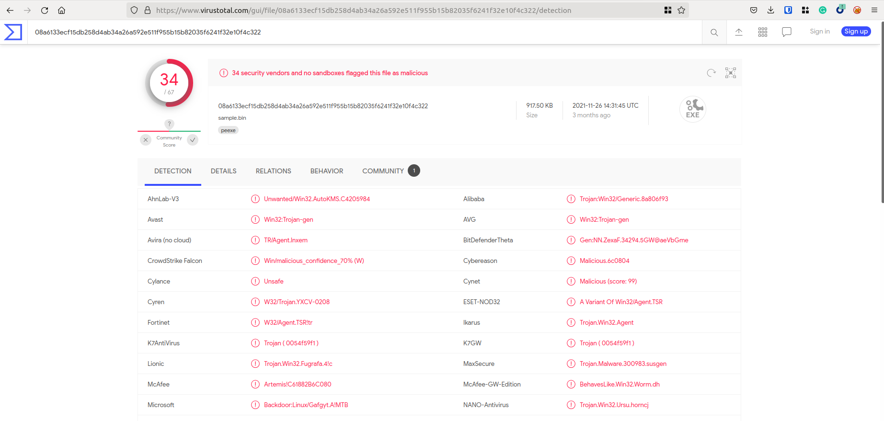
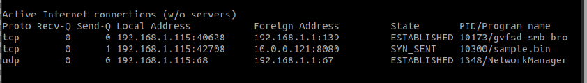
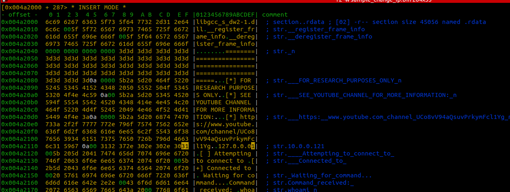
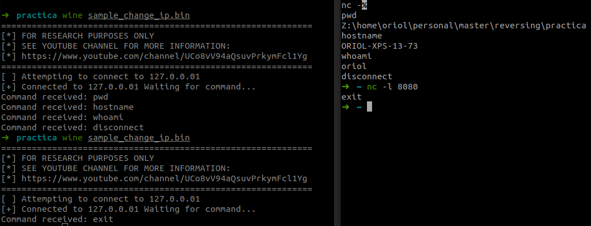

# Anàlisi de Malware (UPC Master Cybersecurity Management XIV )

Alumno:  Oriol Tauleria Martorell

Fecha: 26/03/2022

## Aclaración

Para evitar explicar en cada step el paso de abrir con r2 sample.bin, la notación `[]>` indica que el comando se lanza desde radare2 después de abrir el fichero sample.bin con `r2 sample.bin`.

## Análisis Estático

### 1 ¿Qué tipo de archivo es?

sample.bin es un PE binario, un ejecutable del tipo PE32 para Windows OS.

### ¿Como?

```r2
# Get all info
[]> i
format   pe
...
type     EXEC (Executable file)
...
bintype  pe
bits     32
---
class    PE32
machine  i386
...
os       windows
...
subsys   Windows CUI
```

## 2: ¿arquitectura/bits?

sample.bin está compilado para arquitectura x86 de 32 bits.

### ¿Como?

```r2
# Get "short" info
[]> iq
arch x86
bits 32
os windows
endian little
```

## 3: Identificar los hashes md5, sha1 y sha256 del binario

Utilizando `rahash2`, parte del toolset de r2 podemos sacar los siguientes hashes de sample.bin:

- md5: `c61882b6c0804f6a7e5e0ea833d9762a`
- sha1: `02fa2bc88720eddf0f063692ed050bea841aba08`
- sha256: `08a6133ecf15db258d4ab34a26a592e511f955b15b82035f6241f32e10f4c322`

### ¿Como?

```bash
$ rahash2 -a md5,sha1,sha256 sample.bin
sample.bin: 0x00000000-0x000e55ff md5: c61882b6c0804f6a7e5e0ea833d9762a
sample.bin: 0x00000000-0x000e55ff sha1: 02fa2bc88720eddf0f063692ed050bea841aba08
sample.bin: 0x00000000-0x000e55ff sha256: 08a6133ecf15db258d4ab34a26a592e511f955b15b82035f6241f32e10f4c322
```

## 4: Ir a virustotal y buscar hash, ¿Está detectado en VT?

Sí, está detectado en VT desde noviembre de 2021 como troyano, mas información en esta [url](https://www.virustotal.com/gui/file/08a6133ecf15db258d4ab34a26a592e511f955b15b82035f6241f32e10f4c322/details).



## 5: ¿Fecha de compilación?

La fecha de compilación es 11/05/2020, y la hora de compilación es 01:51:39.

### ¿Como?

```r2
[]> i| grep compiled
compiled Wed Mar 11 01:51:39 2020
```

## 6: ¿Algún string de interés para identificar el tipo de programa que es?

Por las strings que devuelve parece ser una remote shell (limitada).
Las strings que llevan a esta conclusión son:

- `Attempting to connect to`: Indicador de qué intenta conectarse a algún destino.
- `Command received:`: Indicador de qué espera recibir instrucciones.

Por otro lado, si no nos limitamos a strings y revisamos imports vemos que hay algunos elementos sospechosos como `GetUserNameA`, `GetComputerNameA` o `GetCurrentDirectoryA` que indican que posiblemente no sea una remote shell completa, sino que solo permite algunas funciones.
Es probable que este binario realice un ataque de remote shell permitiendo ejecutar:  "whoami", "pwd", "hostname", "disconnect".
Tambien se puede intuir que la remote shell se abrirá hacia 10.0.0.121, pero en este topic ya entraremos mas adelante.

### ¿Como?

```r2
# Primero analizamos el fichero
[]> aaa
# Listamos las strings de .rdata
[]> iz
...
8   0x000a0d21 0x004a2121 29  30   .rdata  ascii   [ ] Attempting to connect to 
...
11  0x000a0d69 0x004a2169 18  19   .rdata  ascii   Command received: 
12  0x000a0d7c 0x004a217c 7   8    .rdata  ascii   whoami\n
13  0x000a0d84 0x004a2184 4   5    .rdata  ascii   pwd\n
14  0x000a0d89 0x004a2189 9   10   .rdata  ascii   hostname\n
15  0x000a0d93 0x004a2193 11  12   .rdata  ascii   disconnect\n
16  0x000a0d9f 0x004a219f 5   6    .rdata  ascii   exit\n
...


# Listamos los imports
[]> ia
...
1   0x004e829c NONE FUNC ADVAPI32.DLL GetUserNameA
...
12  0x004e82d0 NONE FUNC KERNEL32.dll GetComputerNameA
13  0x004e82d4 NONE FUNC KERNEL32.dll GetCurrentDirectoryA
...
```

## 7: ¿Alguna pista sobre el autor?

Al analizar strings encontramos un link a youtube de [stryker2k2](https://www.youtube.com/channel/UCo8vV94aQsuvPrkymFcl1Yg), por lo tanto podemos pensar que el autor es stryker2k2. Si no estubiesemos en un ámbito académico deberíamos indagar mas alrededor de esta información, para descartar pistas falsas o que sea un "copy paste modificado".

### ¿Como?

```r2
> iz | grep youtube
6   0x000a0cd8 0x004a20d8 61  62   .rdata  ascii   [*] https://www.youtube.com/channel/UCo8vV94aQsuvPrkymFcl1Yg\n
```

## 8: ¿Algún FQDN/IP?

En las strings del binario, se encuentra harcodeada la IP `10.0.0.121`, una IP local, por otro lado, no se ha encontrado ningún FQDN que nos aporte valor.

### ¿Como?

En el siguiente fragmento de código pueden verse algunas de las búsquedas realizadas para encontrar FQDNs e IPs en el codigo, no hay un listado exhaustivo, algunas de las búsquedas realizadas pero no documentadas ya que no aportan mas información de las que ya se indican son: "ftp",".com",".es","0x2f" ...

```r2
[]> iz|grep -Eo '[0-9]{1,3}\.[0-9]{1,3}\.[0-9]{1,3}\.[0-9]{1,3}'
10.0.0.121
[0x004012d0]> iz|grep  http
6   0x000a0cd8 0x004a20d8 61  62   .rdata  ascii   [*] https://www.youtube.com/channel/UCo8vV94aQsuvPrkymFcl1Yg\n
215 0x000a2688 0x004a3a88 104 105  .rdata  ascii   not enough space for format expansion (Please submit full bug report at https://gcc.gnu.org/bugs/):\n
[0x004012d0]> iz|grep  -i //
6   0x000a0cd8 0x004a20d8 61  62   .rdata  ascii   [*] https://www.youtube.com/channel/UCo8vV94aQsuvPrkymFcl1Yg\n
215 0x000a2688 0x004a3a88 104 105  .rdata  ascii   not enough space for format expansion (Please submit full bug report at https://gcc.gnu.org/bugs/):\n
```

---

# Análisis Dinámico (en KALI)

## 9: ¿Trata de conectar al algún sitio?

Sí. El ejecutable intenta, como aventurabamos durante el análisis estático, conectarse a 10.0.0.121:8080, como puede verse en la imagen.



### ¿Como?

```bash
# Shell 1: Execute binary
wine sample.bin
# Shell 2: Execute every 0'2 seconds a list of net connections
watch -n 0.2 netstat -nputw
```

## 9.1 Modifica el binario para que conecte a localhost

Una vez abierto el sample con permisos para escribir, queremos sobreescribir una variable que está en .rdata, por lo que vamos a esta sección, entramos en modo visual y sobreescribimos el valor anterior (10.0.0.121) por el de localhost `127.0.0.01`.

Es importante mantener el length de la variable, en lugar del clásico 127.0.0.1 para indicar la IP de localhost añadimos un 0 extra 127.0.0.01 (para tener el mismo length que la IP anterior) ya que una notación y la otra son equivalentes.

### ¿Como?

```bash
# Copy sample and open in w mode
cp sample.bin sample_change_ip.bin
r2 -w sample_change_ip.bin
# Find memory info about string to modify
[]>iz | grep 10.0.0.121
7   0x000a0d16 0x004a2116 10  11   .rdata  ascii   10.0.0.121
[]>  iS | grep ".rdata"
2   0x000a0c00   0xa600 0x004a2000   0xb000 -r-- .rdata
[]> s 0x004a2000
[]> px 500
...
0x004a2110  6c31 5967 0a00 3130 2e30 2e30 2e31 3231  l1Yg..10.0.0.121
...
# Enter visual mode
[]> V
# Enter edit mode with i, go to ascii "tab" and change 10.0.0.121 to 127.0.0.01. (see in visual_mode.png image)
# Exit visual mode with <ESC>
# Close (with changes saved)
[]> q
```



## 10-Utiliza netcat para recibir la conexión

Sabemos, porque en el análisis dinámico hemos detectado intentos de conexión salientes de sample.bin, que la IP destino era 10.0.0.121 y que el puerto destino es 8080. Abrimos `netcat` en modo escucha en este puerto.

```bash
# Shell 1
nc -l 8080

# Shell 2
wine sample_change_ip.bin

```

## 11-Utiliza los posibles comandos sospechosos que hayas visto por strings para ver si obtienes resultados y muestra evidencia de los mismos

Obenemos la lista de comandos al listar los strings o al revisar los distintos flujos en la función de "remote shell".

Estos comandos son:

- `pwd`
- `hostname`
- `whoami`
- `disconnect`
- `exit`

En la siguiente imagen se puede observar el resultado de la ejecución de los mismos:



---

# Reversing

## 12: Localiza en el binario la función en la que se lleva a cabo la conexión y control de comandos, ¿cuál es el offset de la misma?

La función que realiza esta connexión se llama `fcn.0040150d`, tiene un tamaño de 1520 y su offset es `0x0040150d`.

Sabemos donde se llamaba a la función `connect` (gracias al análisis anterior), así que podemos buscar en qué partes del código se encuentra.
Encontramos una sola función que llame a la dll_connect (la que suponemos para realizar la conexión) por lo tanto saltamos a ese offset y buscamos información de esa función.

### ¿Como?

```bash
# list refs with string "connect"
[]> ax|grep -E "connect"
    ...
    fcn.0040150d+208 0x4015dd ->      CALL -> 0x401bec sub.WS2_32.dll_connect
    ...
# Jump to instruction that calls connect
[]> s 0x4015dd
# Show function information
[]> afi

offset: 0x0040150d
...
```

## 13: ¿Qué funciones de la API de windows se usan para la gestión de la conexión y envío de información de red? indica librerías y funciones. Detalla los offsets y calls de las mismas

Nos desplazamos al offset de la función que realiza la llamada a `connect` y analizamos el código, buscando todas las instrucciones que realizen calls, que "solo" son 48 en esta función.

Las funciones que se usan son todas de la libreria Windows Sockets 2 (precisamente ideada para este tipo de acciones a través de red):
`socket`, `connect`, `closesocket`, `WSAStartup`, `WSACleanup` para gestionar la conexión.
`inet_addr`, `htons`para gestionar la dirección IP.
`recv`, `send` para transferir información.

Informaciones (Offset, Call, info):
Offset     | Call                            | Extra info
---        | ---                             | ---
0x00401529 | call sub.WS2_32.dll_WSAStartup  | int WSAStartup(WORD wVersionRequested, LPWSADATA lpWSAData)
0x00401548 | call sub.WS2_32.dll_socket      | SOCKET socket(int af, int type, int protocol)
0x00401569 | call sub.WS2_32.dll_inet_addr   | unsigned long inet_addr(const char *cp)
0x0040157e | call sub.WS2_32.dll_htons       | u_short htons(u_short hostshort)
0x004015dd | call sub.WS2_32.dll_connect     | int connect(SOCKET s, const sockaddr *name, int namelen)
0x004015f5 | call sub.WS2_32.dll_closesocket | int closesocket(SOCKET s)
0x004015fd | call sub.WS2_32.dll_WSACleanup  | int WSACleanup(void)
0x00401692 | call sub.WS2_32.dll_recv        | int recv(SOCKET s, char *buf, int len, int flags)
0x00401786 | call sub.WS2_32.dll_send        | int send(SOCKET s, const char *buf, int len, int flags)
0x00401890 | call sub.WS2_32.dll_send        | int send(SOCKET s, const char *buf, int len, int flags)
0x0040199a | call sub.WS2_32.dll_send        | int send(SOCKET s, const char *buf, int len, int flags)
0x00401a03 | call sub.WS2_32.dll_closesocket | int closesocket(SOCKET s)
0x00401a0b | call sub.WS2_32.dll_WSACleanup  | int WSACleanup(void)
0x00401a3c | call sub.WS2_32.dll_closesocket | int closesocket(SOCKET s)
0x00401a44 | call sub.WS2_32.dll_WSACleanup  | int WSACleanup(void)
0x00401ab4 | call sub.WS2_32.dll_send        | int send(SOCKET s, const char *buf, int len, int flags)

### ¿Como?

```r2
# Jump to function
[]> s 0x0040150d

# Count Calls
[]> pdf | grep call | wc -l
48

# Analyze these calls
[]> pdf | grep call
...

# Analyze the calls to WS2
[]> pdf | grep WS2
...
```
